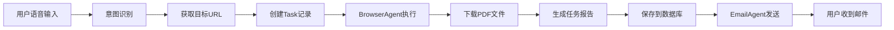

# BrowserAgent & EmailAgent 集成总结

## ✅ 已完成的工作

### 1. 数据库模型更新
- ✅ 在 `Task` 模型中添加 `downloaded_files` 字段（models.py:138）
- ✅ 创建数据库迁移脚本 `migrate_add_downloaded_files.py`

### 2. 服务器集成
- ✅ 更新 `_execute_deep_search_task` 保存下载文件列表（websocket_server.py:412）
- ✅ 重写 `_send_task_notification_email` 使用新的 EmailAgent（websocket_server.py:476-532）
- ✅ 邮件发送支持多收件人
- ✅ 自动附加下载的PDF文件
- ✅ 自动附加操作截图（最多5张）
- ✅ 自动附加任务报告

### 3. 测试脚本
- ✅ `test_browseragent.py` - 测试浏览器代理独立运行
- ✅ `test_email_only.py` - 测试邮件代理独立运行
- ✅ `test_server_integration.py` - 测试完整集成流程

### 4. 文档
- ✅ `BROWSER_AGENT_DEPLOYMENT.md` - 完整部署指南
- ✅ `INTEGRATION_SUMMARY.md` - 集成总结（本文档）

## 📋 工作流程



## 🔧 技术栈

| 组件 | 技术 | 说明 |
|------|------|------|
| 后端框架 | Flask | WebSocket服务器 |
| 数据库 | SQLite | 任务和用户数据 |
| 浏览器自动化 | Playwright | 控制浏览器操作 |
| AI决策 | OpenAI GPT-4o | 浏览器操作决策 |
| 邮件发送 | SMTP (QQ邮箱) | 任务结果通知 |
| 语音识别 | OpenAI Realtime API | 用户输入识别 |
| 意图识别 | 自定义神经网络 | URL映射 |

## 🚀 快速开始

### 1. 安装依赖
```bash
pip install -r requirements.txt
playwright install chromium
```

### 2. 配置环境变量
```bash
cp .env.example .env
# 编辑 .env 文件，填入必要的配置
```

### 3. 初始化数据库
```bash
python init_db.py
```

### 4. 测试各模块

**测试BrowserAgent:**
```bash
python test_browseragent.py
```

**测试EmailAgent:**
```bash
python test_email_only.py
```

**测试完整集成:**
```bash
python test_server_integration.py
```

### 5. 启动服务器
```bash
python websocket_server.py
```

## 🌐 API端点

### 创建深度搜索任务
```bash
POST /deep_search
Content-Type: application/json

{
  "query": "帮我查一下安克创新最新的公告"
}

# 响应
{
  "success": true,
  "task_id": 123,
  "target_url": "https://www.szse.cn/...",
  "message": "任务已创建，正在后台执行中..."
}
```

### 查询任务状态
```bash
GET /tasks/123

# 响应
{
  "id": 123,
  "status": "completed",
  "query": "...",
  "summary": "...",
  "step_count": 5,
  "email_sent": true
}
```

## 📧 邮件发送逻辑

### 收件人确定
1. 优先使用 `user.notification_emails`（JSON数组）
2. 若未配置，使用 `user.email`（Google OAuth邮箱）

### 邮件内容
- **主题**: "VerifAIble 任务完成通知 - [任务查询]"
- **正文**: HTML格式，包含任务摘要、操作步骤、信息来源
- **附件**:
  - 下载的PDF文件（全部）
  - 操作截图（最多5张）
  - 任务报告（Markdown）

### 发送时机
- 任务状态变为 `completed` 时自动发送
- 发送成功后标记 `task.email_sent = True`

## 🔒 安全配置

### 文件权限
```bash
chmod 600 .env                    # 保护环境变量
chmod 755 downloads/              # 下载目录
chmod 755 task_data/              # 任务数据目录
```

### Nginx 配置（生产环境）
```nginx
# 限制文件访问
location /downloads/ {
    alias /path/to/VerifAIble/downloads/;
    # 可添加认证检查
}
```

## 📊 监控和日志

### 查看任务列表
```bash
sqlite3 verifaible.db "SELECT id, status, query, created_at FROM tasks ORDER BY id DESC LIMIT 10;"
```

### 查看日志
```bash
tail -f /var/log/verifaible/error.log
```

### 监控任务执行
```python
# 在Python中查询
from models import Task
pending_tasks = Task.query.filter_by(status='processing').all()
print(f"当前执行中的任务: {len(pending_tasks)}")
```

## 🐛 常见问题

### Q1: 邮件发送失败
**A:** 检查SMTP配置，确保：
- `SMTP_PASSWORD` 是授权码，不是邮箱密码
- QQ邮箱已开启SMTP服务
- 运行 `python test_email_only.py` 测试

### Q2: 浏览器启动失败
**A:** 确保Playwright已正确安装：
```bash
playwright install --with-deps chromium
```

### Q3: 下载文件为空
**A:** 检查：
- `downloads/` 目录是否有写权限
- 浏览器是否成功访问目标网站
- 查看 BrowserAgent 日志确认操作流程

### Q4: 数据库字段不存在
**A:** 运行迁移脚本：
```bash
python migrate_add_downloaded_files.py
```

## 📝 待优化项

### 性能优化
- [ ] 添加任务队列限制并发数（建议最多3个）
- [ ] 定期清理旧文件（7天前的下载文件）
- [ ] 数据库索引优化

### 功能增强
- [ ] 支持任务优先级
- [ ] 添加任务进度回调（WebSocket实时更新）
- [ ] 支持任务取消
- [ ] 邮件模板自定义

### 监控告警
- [ ] 添加Prometheus指标
- [ ] 任务失败告警
- [ ] 磁盘空间监控

## 🎯 部署检查清单

- [ ] 环境变量已配置（.env）
- [ ] 数据库已初始化
- [ ] 数据库迁移已运行
- [ ] Playwright 已安装
- [ ] SMTP 邮件测试通过
- [ ] BrowserAgent 测试通过
- [ ] 完整集成测试通过
- [ ] Nginx 反向代理已配置
- [ ] HTTPS 证书已配置
- [ ] Supervisor 进程管理已配置
- [ ] 日志目录已创建
- [ ] 文件清理定时任务已配置

## 📞 联系方式

如有问题，请：
1. 查看部署文档: `BROWSER_AGENT_DEPLOYMENT.md`
2. 运行测试脚本诊断问题
3. 查看服务器日志
4. 提交 GitHub Issue

---

**最后更新**: 2025-10-28
**版本**: v1.0.0
